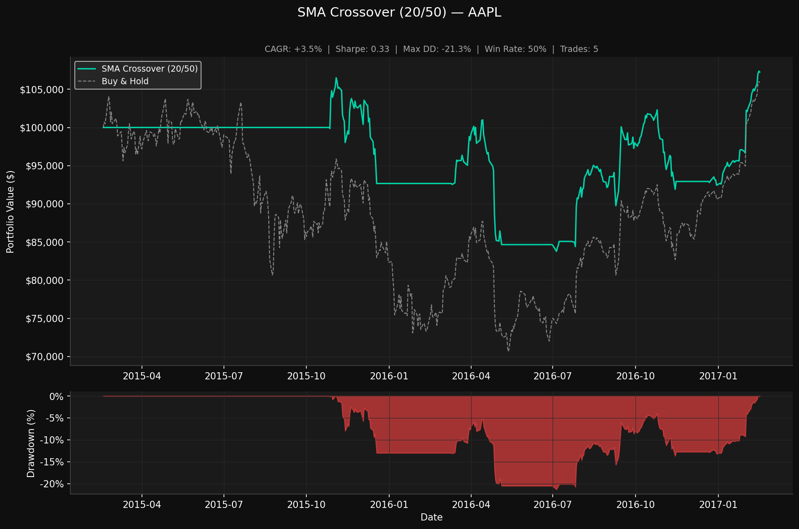

# Backtesting Engine


A from-scratch Python backtesting engine for testing algorithmic trading strategies on historical market data.

## Why Build Your Own?

Libraries like `backtrader` and `zipline` abstract away the details that matter most in interviews: *how* orders are filled, *how* slippage is modeled, *how* the portfolio tracks P&L bar-by-bar. Building from scratch means you can explain every design decision.

## Example Output

SMA crossover strategy on AAPL (2015 to 2017), versus buy and hold:



## Architecture

```
┌─────────────────────────────────────────────────┐
│                    Backtest                      │
│  (orchestrates the bar-by-bar event loop)        │
└────────────┬────────────────────────────────────┘
             │  for each bar:
             │
      ┌──────▼──────┐
      │  Strategy   │  on_bar(date, data_window, portfolio)
      │  (signal)   │  → returns list[Order]
      └──────┬──────┘
             │
      ┌──────▼──────────┐
      │ ExecutionEngine  │  apply slippage + commission
      │  (order fill)    │  → returns Fill
      └──────┬──────────┘
             │
      ┌──────▼──────┐
      │  Portfolio   │  update cash + positions
      │  (state)     │  mark-to-market at close
      └─────────────┘
             │
      ┌──────▼──────┐
      │   Metrics   │  CAGR, Sharpe, Sortino, Max DD ...
      │   Report    │  tearsheet PNG
      └─────────────┘
```

## Features

- **No lookahead bias** — strategies only see data up to the current bar
- **Slippage simulation** — configurable basis points, applied directionally (buys fill high, sells fill low)
- **Commission model** — max(flat fee, % of notional)
- **Pluggable strategies** — implement `BaseStrategy.on_bar()` to define any strategy
- **Two example strategies** — SMA Crossover (trend-following) and RSI (mean-reversion)
- **Performance tearsheet** — equity curve vs. buy-and-hold, drawdown chart
- **Full test suite** — portfolio, execution, and metrics all unit tested

## Setup

```bash
pip install -r requirements.txt
```

## Run a Backtest

```bash
# Default: AAPL, 2018–2024, $100k starting capital
python run_backtest.py

# Custom ticker and date range
python run_backtest.py --ticker SPY --start 2015-01-01 --end 2024-01-01 --cash 50000
```

## Define Your Own Strategy

```python
from src.strategy import BaseStrategy
from src.execution import Order

class MomentumStrategy(BaseStrategy):
    def on_bar(self, date, data, portfolio):
        # data is the full OHLCV history up to today — no lookahead
        if len(data) < 20:
            return []

        # 20-day momentum signal
        momentum = data["Close"].iloc[-1] / data["Close"].iloc[-20] - 1
        position = portfolio.get_position(self.ticker)

        if momentum > 0.05 and position == 0:
            qty = int(portfolio.cash * 0.95 / data["Close"].iloc[-1])
            return [Order(self.ticker, "BUY", qty)]

        if momentum < -0.02 and position > 0:
            return [Order(self.ticker, "SELL", position)]

        return []
```

## Run Tests

```bash
pytest tests/ -v
```

## Sample Output

```
──────────────────────────────────────────────
  SMA Crossover (20/50) — AAPL
──────────────────────────────────────────────
  Total Return          +187.43%
  CAGR                   +19.8%
  Sharpe Ratio            1.043
  Sortino Ratio           1.512
  Max Drawdown           -28.4%
  Win Rate               66.7%
  Profit Factor           2.341
  # Trades                   12
──────────────────────────────────────────────
```

## Tech Stack

Python · pandas · NumPy · yFinance · matplotlib · pytest
